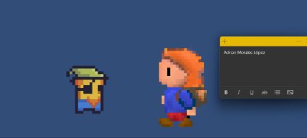
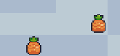
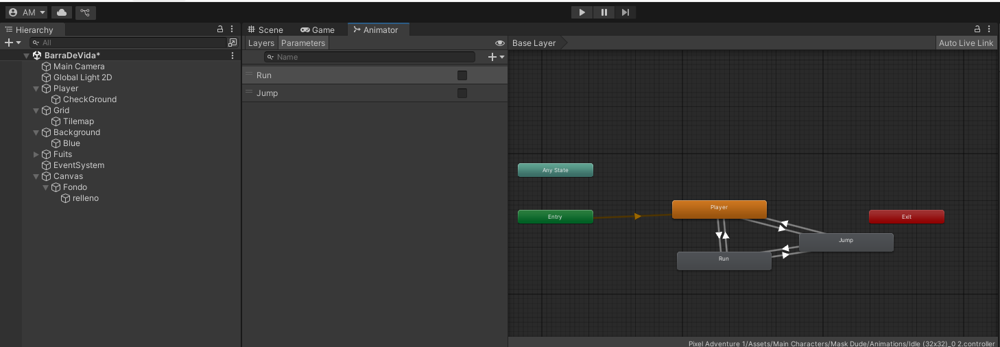
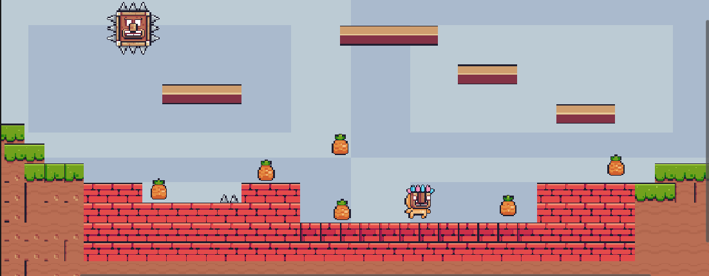
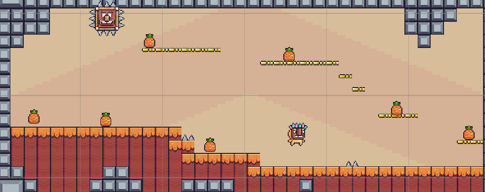
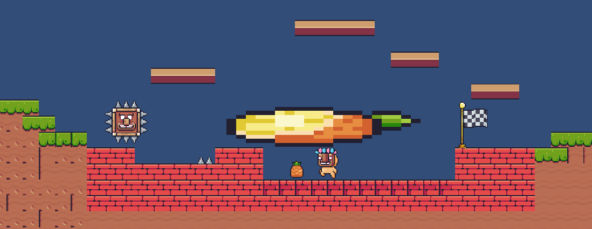

# 🎮 Creación de Videojuegos – Barrón

## 🧩 Unidad 2: Programación Orientada a Objetos para Videojuegos

**Autor:** Adrian Morales López
**Grupo:** GIDS5101

---

## 📚 Tabla de Contenido

1. [Tutoriales y Desafíos](#-tutoriales-y-desafíos)

   * [Desafío 2 - Viernes 3 de octubre](#-desafío-2---viernes-3-de-octubre)
   * [Desafío 3 - Creación de un menú](#-desafío-3---creación-de-un-menú)
2. [Video Tutoriales](#-video-tutoriales)

   * [Video 2: El control del jugador](#-video-2-el-control-del-jugador)
   * [Video 3: Frutas y salto mejorado](#-video-3-frutas-y-salto-mejorado)
   * [Video 4: Animaciones](#-video-4-animaciones)
   * [Video 5: Enemigos](#-video-5-enemigos)
   * [Video 6: Nuevo Nivel](#-video-6-nuevo-nivel)
   * [Video 7: CheckPoint](#-video-7-checkpoint)
   * [Video 8: Hit y Transición](#-video-8-hit-y-transición)
   * [Video 9: Doble Salto y Caída](#-video-8-hit-y-transición)
   * [Video 10: Plataformas](#-video-8-hit-y-transición)

---

## 🎯 Tutoriales y Desafíos

### 🧠 Desafío 2 - Viernes 3 de octubre

Este desafío se entregó en clase. A continuación se muestra la evidencia del resultado final.

#### 🖼️ Resultado

#### 📄 Evidencia

<a href="https://drive.google.com/file/d/1XXMiRTsi_Z2lzrQhXLjjai6wp_vlld4B/view?usp=drive_link">
  
  PDF evidencia de autoría
</a>

---

### 🎮 Desafío 3 - Creación de un menú

#### 🖼️ Resultado

#### 📄 Evidencias

<a href="https://drive.google.com/file/d/1l-TwTsoMgVv8_tTV4A3Vn0kX0vQLtB5C/view?usp=drive_link">
  
  PDF evidencia de autoría
</a>

  

<a href="./package 3.unitypackage">
  
  Evidencia package
</a>

  

<a href="https://drive.google.com/file/d/1dKnx_aFzj9kcLXgiexcV7XIiREFexUYz/view?usp=drive_link">
  
  Video evidencia
</a>

---

## 🎥 Video Tutoriales

### 🎬 Video 2: El control del jugador

#### 🖼️ Resultado

#### 📄 Evidencias

<a href="https://drive.google.com/file/d/1UizqZ82VNEmK1_8F1wkpj_vSkecMWtj0/view?usp=drive_link">
  
  PDF evidencia de autoría
</a>

  

<a href="./package 2.unitypackage">
  
  Evidencia package
</a>

  

<a href="https://drive.google.com/file/d/1qx5T5HVMmnSC3Q5ECsWJIRmlg-3VkWbW/view?usp=drive_link">
  
  Video evidencia
</a>

---

### 🍎 Video 3: Frutas y salto mejorado

#### 🖼️ Resultado

#### 📄 Evidencias

<a href="https://drive.google.com/file/d/1VJ1ooceSHnlkBXq_1XZHFl2mLHt9Bs3w/view?usp=drive_link">
  
  PDF evidencia de autoría
</a>

  

<a href="./package 3.unitypackage">
  
  Evidencia package
</a>

  

<a href="https://drive.google.com/file/d/1Tauokz2gVAcwtIADFhWj3wM4PL-7srqU/view?usp=drive_link">
  
  Video evidencia
</a>

---

### 🕹️ Video 4: Animaciones

#### 🖼️ Resultado

#### 📄 Evidencias

<a href="https://drive.google.com/file/d/1wxEFbGVp-r_ek4b57IU3sLj6VzvGIjo4/view?usp=drive_link">
  
  PDF evidencia de autoría
</a>

  

<a href="./package 4.unitypackage">
  
  Evidencia package
</a>

  

<a href="https://drive.google.com/file/d/1sFvddXxR0G6ZPWZS6CvwXiYKYf6o-Wcl/view?usp=drive_link">
  
  Video evidencia
</a>

---

### 🕹️ Video 5: Enemigos

#### 🖼️ Resultado

#### 📄 Evidencias

<a href="https://drive.google.com/file/d/1NgaAzuV5_JgGRkK38wpHuHCV843O4bWx/view?usp=drive_link">
  
  PDF evidencia de autoría
</a>

  

<a href="./package 6.unitypackage">
  
  Evidencia package
</a>

  

<a href="https://drive.google.com/file/d/1aJE9YYPgFgy8sxovU20NzSkss5OgxNc1/view?usp=drive_link">
  
  Video evidencia
</a>

---

### 🕹️ Video 6: Nuevo Nivel

#### 🖼️ Resultado

#### 📄 Evidencias

<a href="https://drive.google.com/file/d/1q1QAqbVlsMiP14Lr8T-Y_46TZK8MkWuh/view?usp=drive_link">
  
  PDF evidencia de autoría
</a>

  

<a href="./package 7.unitypackage">
  
  Evidencia package
</a>

  

<a href="https://drive.google.com/file/d/1f4Wq0PcPMt_4sQA6RBjf_LA-tz51R4dS/view?usp=drive_link">
  
  Video evidencia
</a>

---

### 🕹️ Video 7: CheckPoint

#### 🖼️ Resultado

#### 📄 Evidencias

<a href="https://drive.google.com/file/d/14yhbU2Z77S0qd-Q01FLGSDKA-gJr8Y9K/view?usp=drive_link">
  
  PDF evidencia de autoría
</a>

  

<a href="./package 8.unitypackage">
  
  Evidencia package
</a>

  

<a href="https://drive.google.com/file/d/1PLFR3C2_Zydk9qbU-9KtbCa3-PhUfCz8/view?usp=drive_link">
  
  Video evidencia
</a>

---

### 🕹️ Video 8: Hit y Transición

#### 🖼️ Resultado

#### 📄 Evidencias

<a href="https://drive.google.com/file/d/1EKtA9vDq3VPtl1g7JHoafNWXzT9PWGGN/view?usp=drive_link">
  
  PDF evidencia de autoría
</a>

  

<a href="./package 9.unitypackage">
  
  Evidencia package
</a>

  

<a href="https://drive.google.com/file/d/16ETd43OyypKN5sMViolQR3ZJ7ukL6jCv/view?usp=drive_link">
  
  Video evidencia
</a>
---

### 🕹️ Video 9: Doble Salto y Caída

#### 🖼️ Resultado

#### 📄 Evidencias

<a href="https://drive.google.com/file/d/1YAyjusaYzRo9OCj3Zu5Au2PZFQ3Cuaz6/view?usp=drive_link">
  
  PDF evidencia de autoría
</a>

  

<a href="./package 10.unitypackage">
  
  Evidencia package
</a>

  

<a href="https://drive.google.com/file/d/1t1ReLZrutVdq1vFB84Rh1E2HtNbUweRX/view?usp=drive_link">
  
  Video evidencia
</a>

---

### 🕹️ Video 10: Plataforma

#### 🖼️ Resultado

#### 📄 Evidencias

<a href="https://drive.google.com/file/d/1833efIA1JMGL7kS6cyMLevpkfvzZRIjg/view?usp=drive_link">
  
  PDF evidencia de autoría
</a>

  

<a href="./package 11.unitypackage">
  
  Evidencia package
</a>

  

<a href="https://drive.google.com/file/d/1bhjUddBN1WTFb74-7EEuxmYpgXDxjzQH/view?usp=drive_link">
  
  Video evidencia
</a>

